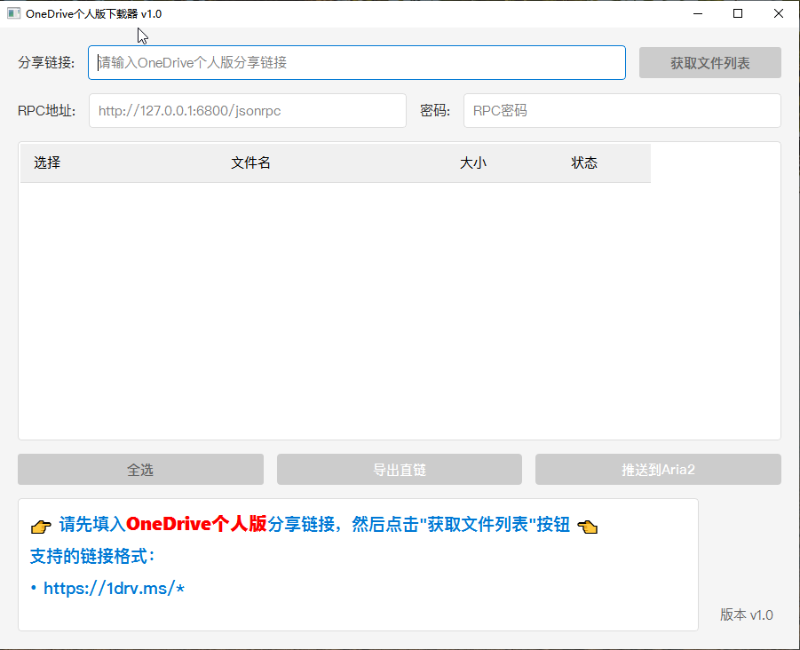

# OneDrive个人版下载器


> ⚠️ **重要提示**：当前版本每次输入新的分享链接获取文件列表时，都需要重新打开软件，否则会提示获取不到链接。此问题正在修复中，敬请期待。



**专用于 OneDrive 个人版分享链接** 的批量下载工具。

## 简介
本工具专门用于下载 **OneDrive 个人版分享链接** 中的文件，功能包括：
- 自动获取文件列表
- 生成文件直接下载链接
- 支持推送到aria2下载

生成的下载文件直链，可以添加到任何下载工具使用。

## 功能特性
- ✅ 支持OneDrive个人版分享链接解析
- ✅ 自动生成直链并可推送到Aria2下载
- ✅ 图形化界面操作（Windows/Linux）
- ✅ 命令行版本同样支持批量操作
- ✅ 多平台支持（Windows/Linux）
- ✅ 自动保存Aria2配置
- ✅ 智能错误提示和故障诊断

## 使用方法

### 图形界面版本
1. 从[Release页面](https://github.com/goukey/onedrive-downloader/releases)下载对应平台的可执行文件
2. 直接运行按提示使用即可
3. 支持功能：
   - 解析OneDrive分享链接
   - 选择文件推送到Aria2
   - 导出直链文件
   - 保存常用配置

#### Windows 版本
- 下载 `OneDrive下载器.exe` 文件
- 双击运行即可使用

#### Linux 版本
- 下载 `OneDrive下载器` 可执行文件
- 添加执行权限：`chmod +x OneDrive下载器`
- 双击运行或在终端中执行 `./OneDrive下载器`
- 可选：使用提供的 `.desktop` 文件创建桌面快捷方式

### 命令行版本
```bash
# 安装依赖
# 使用清华源安装依赖（推荐国内用户使用）
pip install -i https://pypi.tuna.tsinghua.edu.cn/simple requests  # 命令行版本只需要 requests 库
# 或使用默认源安装
# pip install requests

# 运行下载器
python oneclick_downloader.py
```

## 常见问题
Q: 为什么提示RPC连接失败？
A: 请检查：
  1. Aria2是否已启动并启用RPC
  2. RPC地址格式是否正确（需以/jsonrpc结尾）
  3. 防火墙是否放行了Aria2的端口（默认6800）

Q: 如何更新软件？
A: 直接下载最新Release的可执行文件即可，配置会自动保留

Q: Linux 版本如何创建桌面快捷方式？
A: 下载 `.desktop` 文件，修改其中的路径后放置在 `~/.local/share/applications/` 目录

## 注意事项
- 首次使用需要配置Aria2的RPC地址和密码
- 获取的文件直链有效期为1小时，超时需要重新运行程序获取
- ⚠️ **xxx.sharepoint.com 形式的分享链接推荐使用** [OneDriveShareLinkPushAria2](https://github.com/gaowanliang/OneDriveShareLinkPushAria2)

## 环境要求
- Windows用户：Windows 7/8/10/11
- Linux用户：Python 3.6+，支持图形界面的桌面环境
- Aria2 (需要开启RPC)

## 许可证
MIT License

## 致谢
代码参考了 [OneDriveShareLinkPushAria2](https://github.com/gaowanliang/OneDriveShareLinkPushAria2) [@gaowanliang](https://github.com/gaowanliang)

## 贡献指南
欢迎提交Issue和PR，请确保：
- 代码符合PEP8规范
- 新功能需包含测试用例
- 更新相关文档

## 开源协议
MIT License 